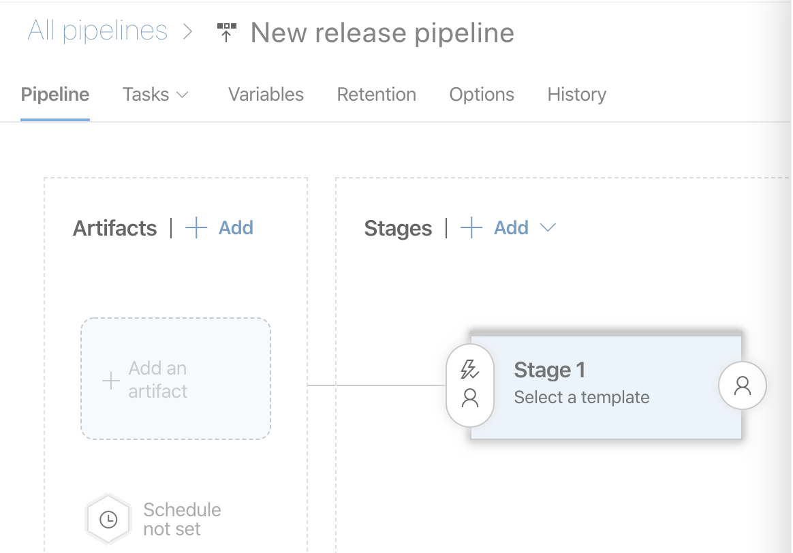
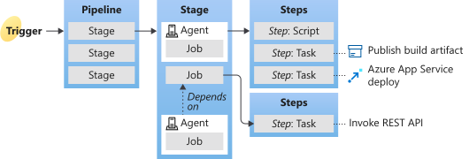

Before You Start
================

Each topic discussed here is big enough to have its own post. However, I
will only explain the essential concepts to follow this guide.

Database Deployment Approach
----------------------------

Understanding two different database deployment approaches are essential
to understand why the Flyway is implemented in that way. Let's check out
the comparison of two approaches.

In order to understand Flyway’s implementation, it is important to
understand two general database deployment approaches: the declarative
approach and the imperative approach. Let’s check out how these two
approaches compare.

|  | Declarative | Imperative |
|------------------------------|------------------------------------------------------------------------------------------------------------|--------------------------------------------------|
| Approach | You describe how you want your schema to look, instead of encoding inside a script on how to implement it. | Compile changes-scripts and apply them in order. |
| Tools | Redgate SQL Source Control, SSDT, etc. | Sqitch, Flyway, Liquibase, etc. |
| Tools that support Snowflake | N/A | Sqitch, Flyway |

The declarative approach requires a tool that will generate scripts to
change the target database structure once the user has defined the
desired state of that database. From the user’s perspective, this is the
simpler and more straightforward approach. Unfortunately, a tool doesn’t
currently exist that supports the declarative approach for Snowflake.

The imperative approach requires users to generate the change scripts on
his or her own. A tool using this approach will simply execute the
change scripts on the target database in the order that the user has
specified.

Flyway
------

Flyway is a change-script based database migration tool with a
command-line interface. Flyway's terminology for "change script" is
"migration script". Therefore, I will use the term "migration script"
from now on.

### How to manage migration scripts

Once you’ve configured a naming convention for your migration scripts,
Flyway will look for all files that follow the naming convention and
apply those scripts. This means that you are free to choose how you
organize your scripts.

Flyway supports two types of scripts recognized by the naming
convention.

-   Versioned - V\[Version\]**\_\_**\[Description\].sql

    -   The versioned migration script is when you need to apply change
        scripts in order exactly once.

-   Repeatable - R**\_\_**\[Description\].sql

    -   The repeatable migration script is used to manage database
        objects like view whose definition can then simply be maintained
        in a single file in version control.

Note that the double-underscore is used as a delimiter. The below are
sample migration scripts
from [kulmam92](https://github.com/kulmam92)/**snowflake\_flyway**.

```
└── databases
    └── flyway_demo
        ├── V20200120.1__SCHEMA_DEMO_Create.sql
        ├── V20200120.2__TABLE_DEMO.DEMOTABLE_Create.sql
        ├── V20200123.1__TABLE_DEMO.DEMOTABLE_Alter.sql
        └── view
            └── R__VIEW_DEMO.V_DEMOVIEW.sql
```

### How to deploy the migration scripts

Simply run "flyway migrate" with the JDBC connection string and
migration script location.

```
> flyway migrate -url=jdbc:snowflake://<myaccount>.snowflakecomputing.com/?warehouse=<MY_WH>&role=<MY_ROLE>&authenticator=snowflake&db=flyway_demo -user=<MY_USER> -password=******** -locations="filesystem:./databases/flyway_demo"
 
Flyway Community Edition 6.2.2 by Redgate
Database: jdbc:snowflake://<myaccount>.snowflakecomputing.com:443/ (Snowflake 4.5)
Successfully validated 2 migrations (execution time 00:01.228s)
Current version of schema "PUBLIC": << Empty Schema >>
Migrating schema "PUBLIC" to version 20200120.1 - SCHEMA DEMO Create
Migrating schema "PUBLIC" to version 20200120.2 - TABLE DEMO.DEMOTABLE Create
Successfully applied 2 migrations to schema "PUBLIC" (execution time 00:14.090s)
```

### How Flyway tracks changes

Each database deployed by Flyway will have a metatable
"flyway\_schema\_history". This table keeps track of deployed scripts.

```
SELECT "installed_rank", "version", "type", "script" , "checksum", "installed_on"
FROM FLYWAY_DEMO."PUBLIC"."flyway_schema_history";
 
installed_rank|version   |type|script                                      |checksum  |installed_on       |
--------------|----------|----|--------------------------------------------|----------|-------------------|
             1|20200120.1|SQL |V20200120.1__SCHEMA_DEMO_Create.sql         |1760340838|2020-02-20 19:45:16|
             2|20200120.2|SQL |V20200120.2__TABLE_DEMO.DEMOTABLE_Create.sql| 959833825|2020-02-20 19:45:22|
             3|20200123.1|SQL |V20200120.1__TABLE_DEMO.DEMOTABLE_Alter.sql | 959833825|2020-02-23 10:10:10|
             4|          |SQL |R__VIEW_DEMO.V_DEMOVIEW.sql                 | 659846811|2020-02-20 10:10:15|
```

Although this post only covers the "flyway migrate" command, Flyway has
many more features not covered here. If you want to learn more, refer
to [flyway's official
documentation](https://flywaydb.org/documentation/).

Azure DevOps Pipeline
---------------------

Azure Pipelines is a cloud service that you can use to automatically
build and test your code project and make it available to other users.
This is available on two platforms.

-   Azure DevOps Service - Software as a service (SaaS) version
-   Azure DevOps Server 2019 - Self-hosted version (previously called
    Team Foundation Server)

This post is targeted to Azure DevOps Service which the latest features
are available on.

### Pipelines Submenu

If you are new to TFS or Azure DevOps Service/Server, I will explain
what the Pipelines (Azure DevOps → Organization → Project → Pipelines)'s
submenu does.

| Submenu | Description |
|-------------------|-------------------------------------------------------------------------------------------------------------------------------------------------------------------------------------------------------------------------------------------------------------------------------------------------------------------------------|
| Pipelines | A pipeline defines the continuous integration and deployment process for your app. It's made up of one or more stages. It can be thought of as a workflow that defines how your test, build, and deployment steps are run. |
| Environments | An environment is a collection of resources that can be targeted by deployments from a pipeline. Typical examples of environment names are Dev, Test, QA, Staging, and Production. |
| Releases | A release is the package or container that holds a versioned set of artifacts specified in a release pipeline in your DevOps CI/CD processes.<br>A release pipeline is a process to deploy artifacts. |
| Library | The library is a collection of includes_ build and release assets for a project. Assets defined in a library can be used in multiple build and release pipelines of the project<br><br>* Variable groups<br>The variable group is used to store values that you want to control and make available across multiple pipelines. |
| Task groups | A task group allows you to encapsulate a sequence of tasks, already defined in a build or a release pipeline, into a single reusable task that can be added to a build or release pipeline, just like any other task.<br>Task groups are not supported in YAML pipelines. Instead, you can use templates. |
| Deployment groups | A deployment group is a logical set of deployment target machines that have agents installed on each one. Deployment groups make it easy to define groups of target servers for deployment. |

Now you know where to go to find what you need.

### Pipeline Definition Methods

A pipeline can be defined as either YAML or Classic Interface. I will
use the YAML method in the post.

| Method | Detail |
|----------------------------|-------------------------------------------------------------------------------------------------------------------------------------------------------------------------------------------------------------------------------------------------------------------------------------------------------------------------------------------------------------------------------------------------------------|
| Classic Interface<br>- UI | Create and configure pipelines in the Azure DevOps web portal with the Classic user interface editor.<br><br><a href="url"></a><br><br>With Classic Interface you can create Classic Build and Classic Release pipeline.<br>*  Classic Build is used to create an artifact.<br>*  Classic Release is used to do the staged deployment. For example, to deploy the same artifact to different environments using the stage and approval. |
| YAML<br>- Pipeline as code | You define your pipeline in a YAML file called azure-pipelines.yml with the rest of your app.<br><pre>name: $(Date:yyyyMMdd)$(Rev:.r)<br>variables:<br>  var1: value1<br>jobs:<br>- job: One<br>  steps:<br>  - script: echo First step!</pre> |

There are some feature differences. The detail can be found from  [CI,
CD, YAML & Classic: Feature
availability](https://docs.microsoft.com/en-us/azure/devops/pipelines/get-started/pipelines-get-started?view=azure-devops#feature-availabilityhttps://docs.microsoft.com/en-us/azure/devops/pipelines/get-started/pipelines-get-started?view=azure-devops#feature-availability).

### Pipeline Key Concepts

It's critical to understand the key concept of the pipeline structure.
Basically, it's a workflow that you can chain multiple stages and steps
to do various things.

<a href="url"></a>

Picture from [Key concepts for new Azure Pipelines
users](https://docs.microsoft.com/en-us/azure/devops/pipelines/get-started/key-pipelines-concepts?view=azure-devops)

| Key Concept | Description |
|-------------|--------------------------------------------------------------------------------------------------------------------------------------------------------------------------------------------------------------------------------------------------------------------------------------------------------------------------------------------------------------------------------------------------------------------------------------------------------|
| Trigger | A trigger is something that's set up to tell the pipeline when to run. |
| Pipeline | A pipeline defines the continuous integration and deployment process for your app. It can be thought of as a workflow that defines how your test, build, and deployment steps are run. |
| Stage | A stage is a logical boundary in the pipeline.<br>It can be used to mark separation of concerns (e.g., Build, QA, and production). |
| Aegent | When your build or deployment runs, the system begins one or more jobs. An agent is installable software that runs one job at a time. |
| Job | Each job runs on one agent. A job can also be agentless, in which case it is run by the Azure DevOps Service/Server itself.<br>A job represents an execution boundary of a set of steps. All of the steps run together on the same agent.<br>A deployment job is a special type of job. It's a collection of steps to run sequentially against the environment. In YAML pipelines, we recommend that you put your deployment steps in a deployment job |
| Step | A step is the smallest building block of a pipeline. |
| Script | Script,steps are a type of step that runs code in your pipeline using command line,,PowerShell, or Bash. Unlike a task, a script is custom code that is specific,to your pipeline. These are really just script tasks, but have shortcut,syntax in YAML definitions. |

Now that you are equipped with an understanding of the basic concepts,
it's time to create an implementation plan.

Implementation Plan
===================

Design Choices
--------------

-   Pipeline creation
    -   YAML will be used to define a pipeline as a code
-   Database Project Structure
    -   Folder structure
        -   Versioned - databases\[DatabaseName]\MigrationScript.sql
        -   Repeatable - databases\[DatabaseName]\[ObjectType]\MigrationScript.sql
    -   Migration script file naming
        -   Versioned - V[ReleaseDate].[Sequence]__[ObjectType]_[Schema].[ObjectName]_[Create|Drop|Alter].sql
        -   Repeatable - R__[ObjectType]_[Schema].[ObjectName].sql
    -   ```
        └── databases
        └── flyway_demo
            ├── V20200120.1__SCHEMA_DEMO_Create.sql
            ├── V20200120.2__TABLE_DEMO.DEMOTABLE_Create.sql
            ├── V20200123.1__TABLE.DEMO.DEMOTABLE.Alter.sql
            └── view
                └── R__VIEW_DEMO.V_DEMOVIEW.sql
        ```
-   Environment and Deployment Policy
        
    I'm going to use only three environments to simplify the example.

    | Environment | Approval Policy |
    |-------------|-------------------------------------------------------------------------------------------------------------|
    | DEV | Push changes to the branch will trigger the deployment |
    | QA | QA will manually approve the deployment |
    | PROD | QA will manually approve the deployment<br>This may not the right approach but I will use QA for this demo. |
-   Database Naming
    -   Database Naming
        -   [DatabaseName][|_[EnvironmentName]]
        -   There's no postfix for the PROD environment.

            | Environment | Approval Policy |
            |-------------|-----------------|
            | DEV | FLYWAY_DEMO_DEV |
            | QA | FLYWAY_DEMO_QA |
            | PROD | FLYWAY_DEMO |
-   Git Branching
    -   There are many best practices including Gitflow Workflow. However, I will use a single branch(master) for simplicity.
-   Docker
    -   Instead of installing flyway, I will use docker container as much as possible.
    -   The official flyway docker image isn't compatible with azure due to some restrictions. Therefore, I ended up creating a new image for this.
        -   dockerhub: kulmam92 / flyway-azure
    -   Details about the restrictions and issues when using the official flyway docker image are explained in the README section.
-   Template
    -   Templatize implementation for reusability
        -   YAML - YAML pipeline template
    -   FYI, you can templatize the Classic method using Task group.

Helper Resources
----------------

I created a GitHub
repository [kulmam92/snowflake_flyway](https://github.com/kulmam92/snowflake_flyway) that
contains all the resources used in this post. Clone or download the
repository to follow the Step-by-Step implementation guide.

Below are the contents of the GitHub repository.

```
├── README.md
├── LICENSE
├── databases
│   ├── README.md
│   └── flyway_demo
│       ├── V20200120.1__SCHEMA_DEMO_Create.sql
│       ├── V20200120.2__TABLE_DEMO.DEMOTABLE_Create.sql
│       ├── V20200123.1__TABLE_DEMO.DEMOTABLE_Alter.sql
│       └── view
│           └── R__VIEW_DEMO.V_DEMOVIEW.sql
└── templates
    ├── README.md
    ├── TaskGroups
    ├── VariableGroups
    │   ├── Classic
    │   └── YAML
    │       └── Snowflake.Database.env      <- Variable group for YAML pipeline
    └── YAMLpipelines
        ├── azure-pipelines.yml             <- YAML pipeline script
        └── templates
            ├── snowflakeFlywayBuild.yml    <- YAML pipeline template for snowflake build using flyway
            └── snowflakeFlywayDeploy.yml   <- YAML pipeline template for snowflake deploy using flyway
```

[<< Prev](index.md) | [Next >>](02.step_by_step_implementation.md)