Step-by-Step Implementation
===========================

Setup Snowflake
---------------

Use the script below to create databases and a user for this demo.

```
-- Create Databases
CREATE DATABASE FLYWAY_DEMO COMMENT = 'Azure DevOps deployment test';
CREATE DATABASE FLYWAY_DEMO_DEV COMMENT = 'Azure DevOps deployment test';
CREATE DATABASE FLYWAY_DEMO_QA COMMENT = 'Azure DevOps deployment test';

-- Create a Deploy User
-- I'm granting sysadmin role to make it simple but you'd better to create a role with necessary permissions.
create user devopsuser password='<mypassword>' default_role = sysadmin;
```

Project Creation
----------------

Create your demo project - Snowflake\_Flyway.

| Step | Detail |
|------------------|--------|
| Create a Project | <a href="url">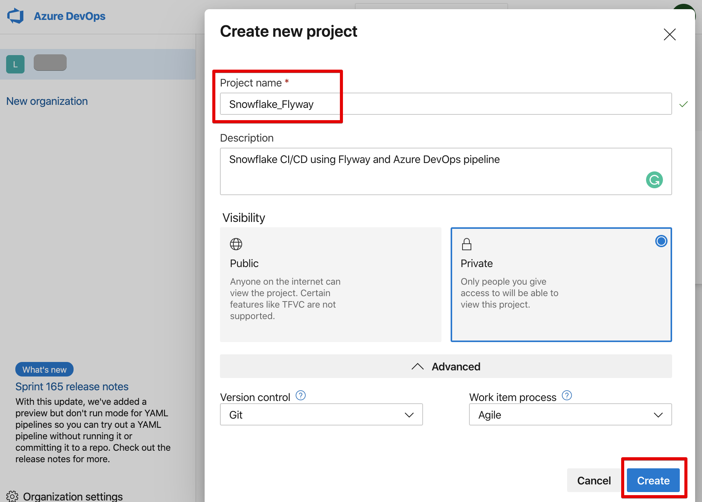</a> |

Project Setup
-------------

There are some manual tasks that you need to do to set up the
demo environment using the resources from
[kulmam92/snowflake_flyway](https://github.com/kulmam92/snowflake_flyway).

### Environment

You need to have an environment to be able to add the Approval step.
Let's create the necessary Environments and Approvals.

| Step | Detail |
|------------------------------------------|--------------------------------------------------------------------------------------------------------------------------------------------------------------------------|
| Create a PROD environment | <a href="url">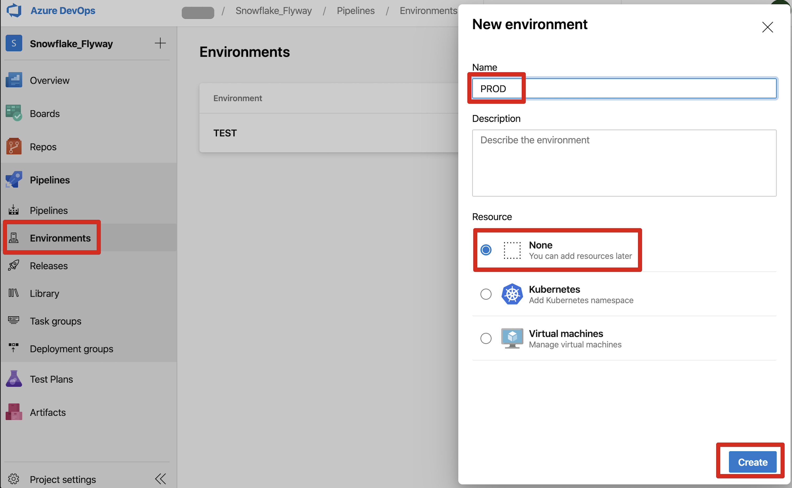</a> |
| Create Approval for the PROD environment | <a href="url">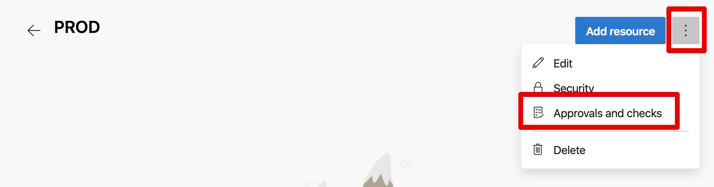</a><br><br><a href="url"></a><br><br><a href="url">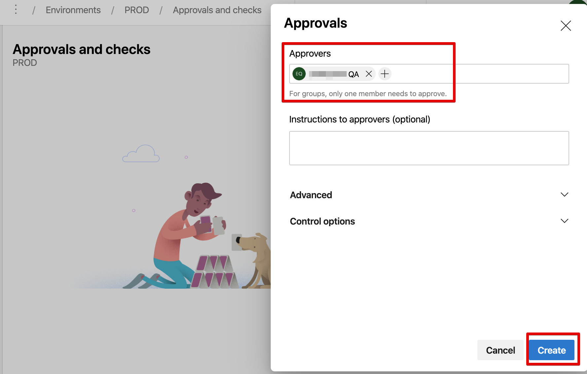</a><br><br><a href="url">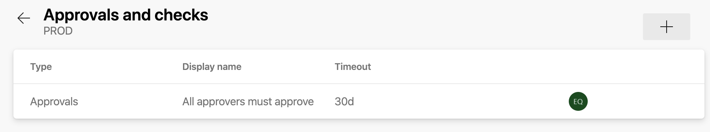</a> |
| Create a QA environment | Follow instructions for the PROD environment. |
| Create Approval for the QA environment | Follow instructions for the PROD environment. |
| Create a DEV environment | Follow instructions for the DEV environment.<br>Don't create Approval since<br>the Push will trigger a deployment to the DEV environment without manual<br>intervention. |

### Variable Group

When you have a common set of variables that will be used in multiple
pipelines, you create a variable group once and reference them in many
groups.

| Step | Detail |
|------------------------------------------|--------------------------------------------------------------------------------------------------------------------------------------------------------------------------|
| Create Variable Group | <a href="url">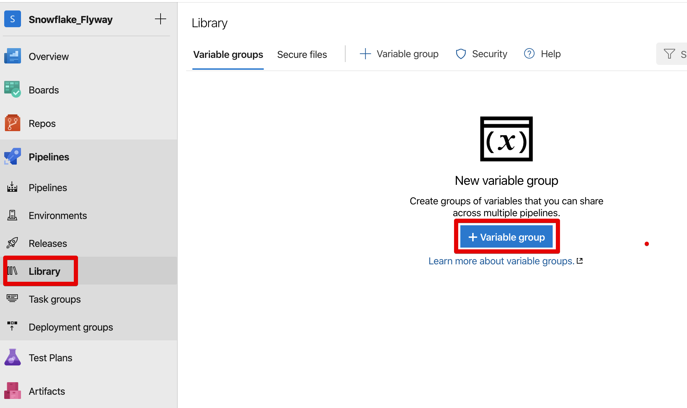</a><br><br>[Snowflake.Database.env](https://github.com/kulmam92/snowflake_flyway/blob/master/templates/VariableGroups/YAML/Snowflake.Database.env) of the [kulmam92/snowflake_flyway](https://github.com/kulmam92/snowflake_flyway) has the list of variables needed for this demo<br><br><a href="url">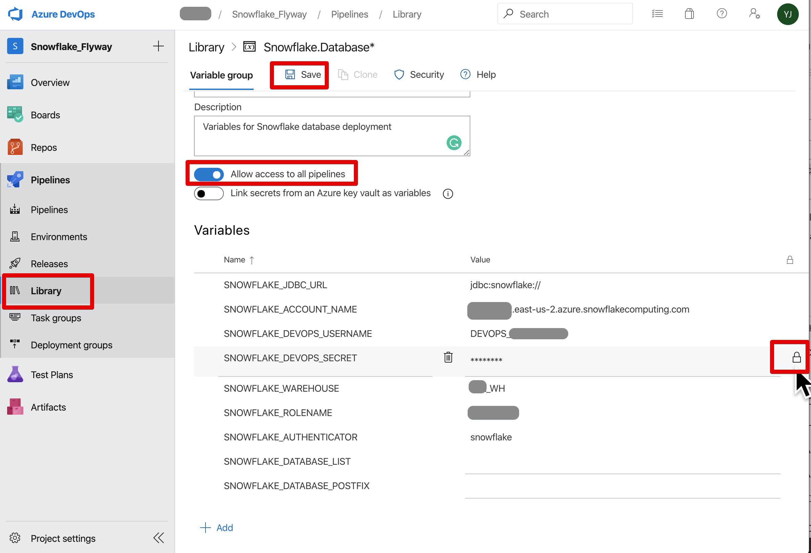</a> |

Set up a Template Repo
----------------------

The repository with the same name as the project will be created by
default. This will be our snowflake database project repository. I will
create another repository to keep templates since it's a common module.
Your team may have a repository for this purpose already.

| Step | Detail |
|------------------------------------------|--------------------------------------------------------------------------------------------------------------------------------------------------------------------------|
| Create a Repo | Repository name: PipelineCommon<br><br><a href="url">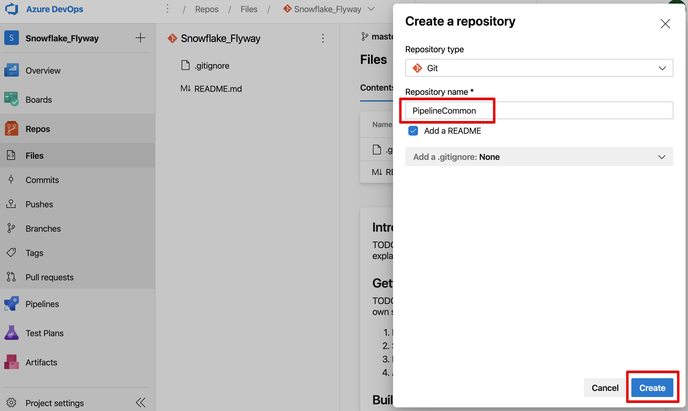</a> |
| Add Pipeline Template to PipelineCommon | Add Pipeline Template to PipelineCommon   Copy all the files in the [templates folder](https://github.com/kulmam92/snowflake_flyway/tree/master/templates) of the [kulmam92/snowflake_flyway](https://github.com/kulmam92/snowflake_flyway) to your repo and push changes to PipelineCommon.<br><br>Your repo will look like this after that.<br><br><a href="url"></a> |

Create a Pipeline for the Database(Snowflake\_flyway) Repo
----------------------------------------------------------

| Step | Detail |
|------------------------------------------|--------------------------------------------------------------------------------------------------------------------------------------------------------------------------|
| Create a Pipeline | Click "Create Pipeline"<br><br><a href="url">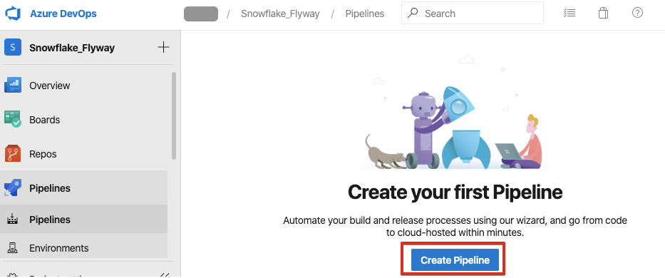</a> |
| Connect Tab | Choose "Azure Repos Git"<br><br><a href="url">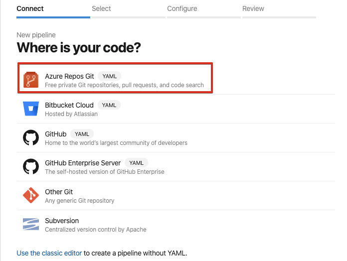</a> |
| Select Tab | Choose "Snowflake\_flyway"<br><br><a href="url">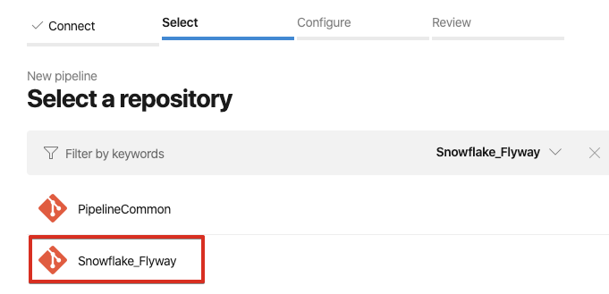</a> |
| Configure Tab | Choose "Starter pipeline"<br><br><a href="url">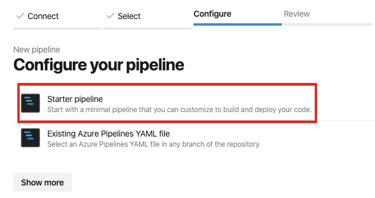</a> |
| Review Tab | Paste the contents of [templates\\YAMLpipelines\\azure-pipelines.yml](https://github.com/kulmam92/snowflake_flyway/blob/master/templates/YAMLpipelines/azure-pipelines.yml) file of the [kulmam92/snowflake_flyway](https://github.com/kulmam92/snowflake_flyway) to the editor.<br><br><a href="url">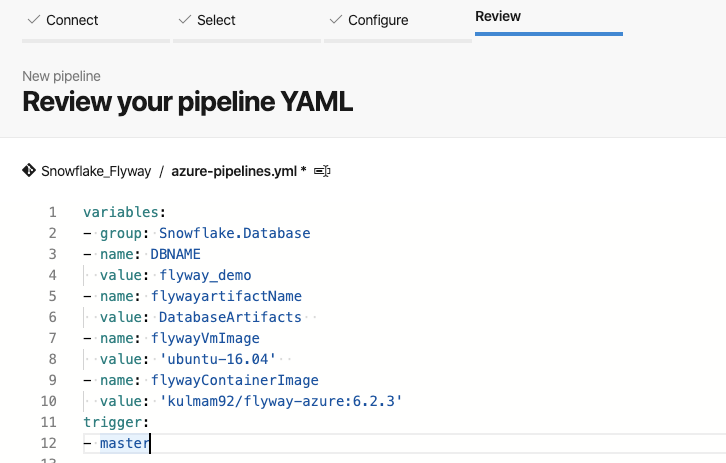</a><br><br>Add the template repository resource at the beginning of the YAML script. This will let you reference templates in the PipelineCommon Repo.<br><br><pre>resources:<br>  repositories:<br>  # template repository<br>  - repository: PipelineCommon<br>    type: git<br>    name: PipelineCommon</pre><br>Modify template reference.<br><br><pre># For build Stage<br>  jobs:<br>  - template: YAMLpipelines/templates/snowflakeFlywayBuild.yml@PipelineCommon<br># For deploy Stages<br>  jobs:<br>  - template: YAMLpipelines/templates/snowflakeFlywayDeploy.yml@PipelineCommon</pre><br><a href="url">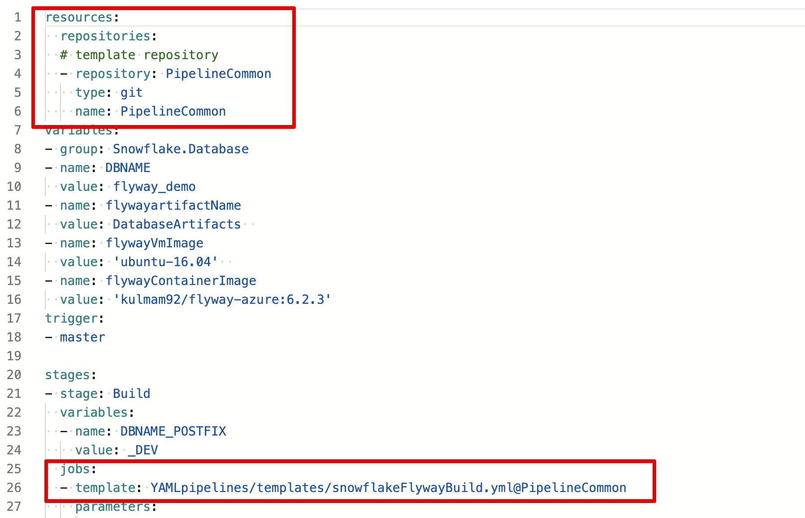</a> |
| Save | Save<br><br><a href="url">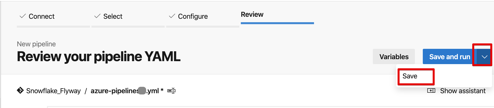</a><br><br><a href="url">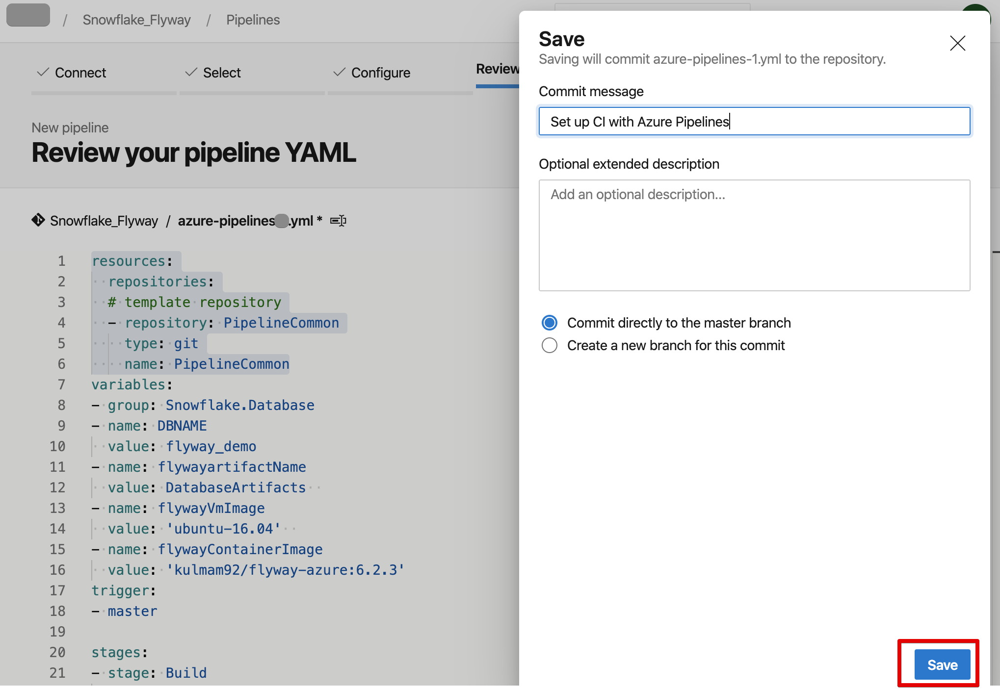</a> |

Add Demo Scripts to the Database(Snowflake\_flyway) Repo
--------------------------------------------------------

| Step | Detail |
|------------------------------------------|--------------------------------------------------------------------------------------------------------------------------------------------------------------------------|
| Clone Snowflake\_flyway Repo | I will use the VS code.<br><br><a href="url">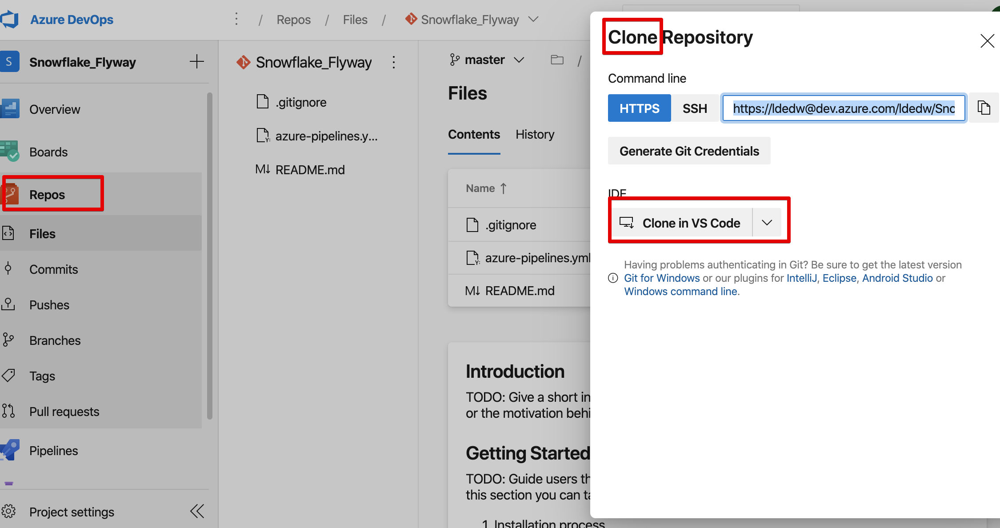</a> |
| Copy migration scripts to your database Repo | Copy databases folder of the helper resource repository([kulmam92/snowflake_flyway](https://github.com/kulmam92/snowflake_flyway)) and paste to your database repo<br><br><a href="url">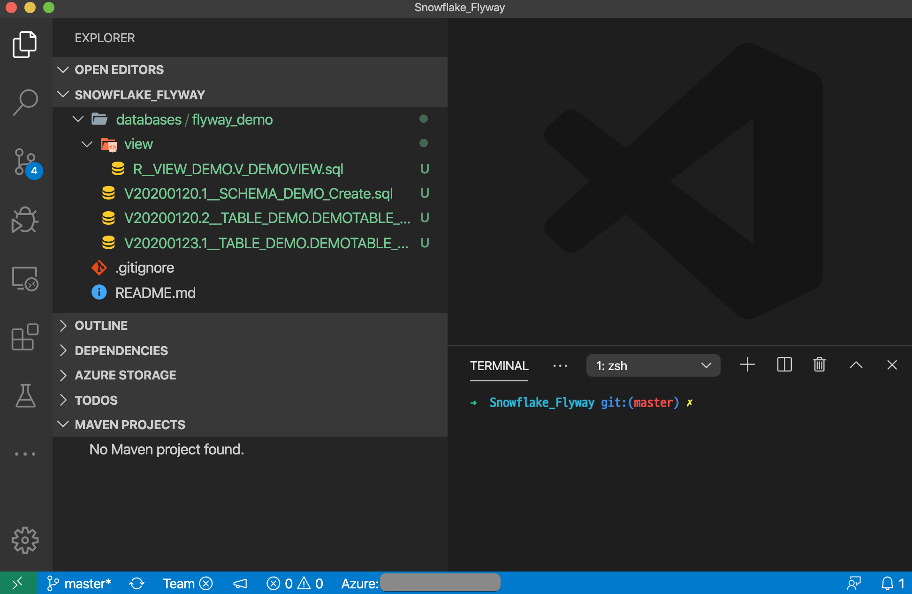</a> |
| Commit and Push changes | <a href="url">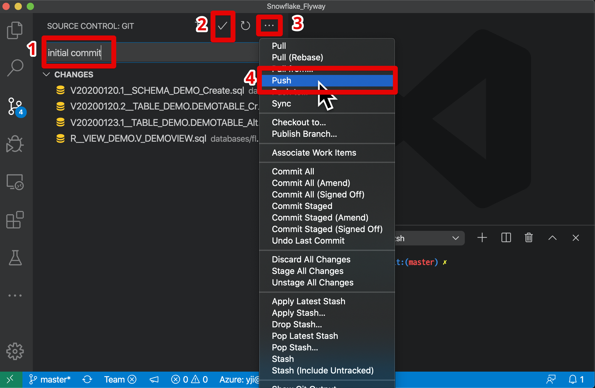</a> |
| Your changes will be in the Repo  | <a href="url">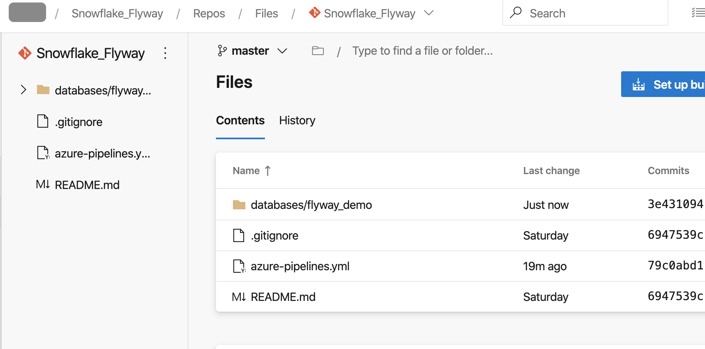</a> |


Check Pipeline(Snowflake\_Flyway) Status
----------------------------------------

Your push to master will trigger the pipeline (Snowflake\_Flyway) that
you created.

| Step | Detail |
|------------------------------------------|--------------------------------------------------------------------------------------------------------------------------------------------------------------------------|
| Pipeline Run History | Navigate to Pipelines → Pipelines → Snowflake_Flyway and click a Run You will see below if you follow everything correctly<br><br><a href="url">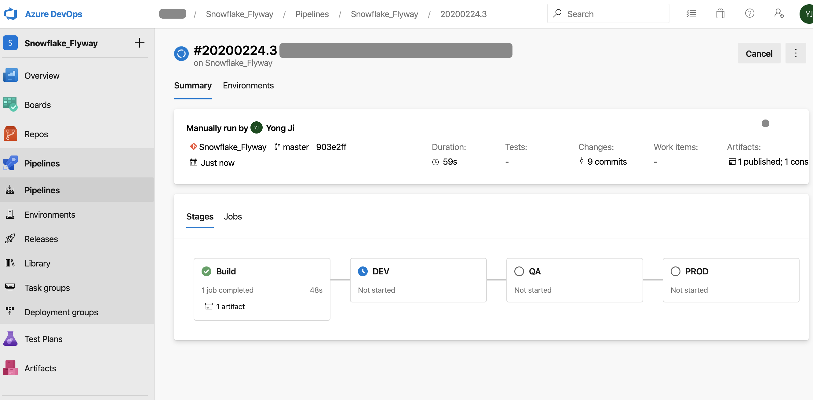</a> |
| Approve to deploy to QA | Deployment to QA is waiting for the approval.<br><br><a href="url">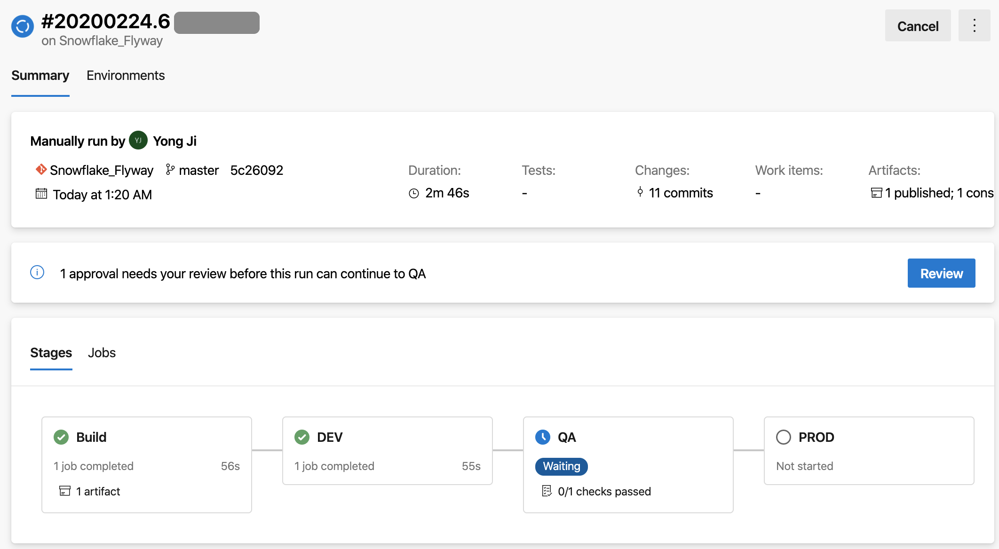</a><br><br>Click review and approve.<br><br><a href="url">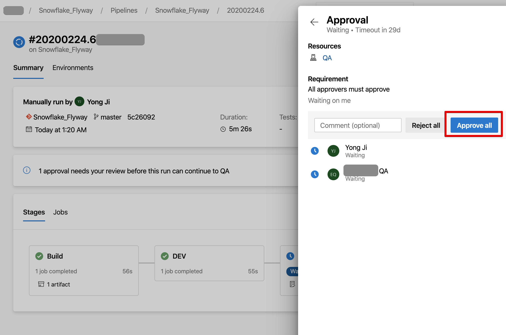</a> |
| Approve to deploy to PROD | Do the same as QA for PROD deployment. |

This is the end of the Step-by-Step implementation guide. Now you have a
working demo pipeline.


[<< Prev](01.before_you_start.md) | [Next >>](03.iplementation_details.md)