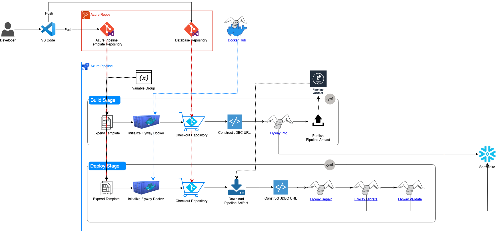

Implementation Details
======================

Deployment Flow Diagram
-----------------------

This diagram shows detailed steps of the demo pipeline implementation.
To simplify the diagram, I didn't include the environment and approval.

<a href="url"></a>

Pipeline Templates
------------------

The core of this demo implementation is the two pipeline template files.

-   snowflakeFlywayBuild.yml
-   snowflakeFlywayDeploy.yml

Those are very similar as you can see from the deployment flow diagram.

### Build Template- snowflakeFlywayBuild.yml

This defines a build process. Let me ask you this. What you do expect at
the build stage?

-   Detect errors can be caught without running the program.
-   Some testing
-   Create an Artifact

How does it tie with Flyway?

-   Detect errors can be caught without running the program.
    -   Flyway has no concept of the build. However, I run "flyway info"
        to list up scripts to be deployed.

-   Some testing
    -   Flyway has no concept of testing. However, I run "flyway info"
        to list up scripts to be deployed.

-   Create an Artifact
    -   Artifact for Flyway will be migration scripts

It's time for actual code.

-   Declare Parameter
    
    databasePostfix is used to point to the right database name of the given
    ```
    parameters:
    - name: jobName
      default: ''
    - name: databaseName
      default: ''
    - name: databasePostfix
      default: '_DEV'
    - name: artifactName
      default: 'DatabaseArtifacts'  
    - name: vmImage
      default: 'ubuntu-16.04'  
    - name: containerImage
      default: 'kulmam92/flyway-azure:6.2.3'
    ```
-   Define Job Properties
    ```
    jobs:
    - job: ${{ parameters.jobName }}
      timeoutInMinutes: 10
      pool:
        vmImage: ${{ parameters.vmImage }}
      container:
        image: ${{ parameters.containerImage }}
    ```
-   Run Flyway Info
    ```
    steps:
    - bash: |
        echo "##vso[task.setvariable variable=SNOWFLAKE_JDBC_URL]$(SNOWFLAKE_JDBC_URL)$(SNOWFLAKE_ACCOUNT_NAME)/?warehouse=$(SNOWFLAKE_WAREHOUSE)&role=$(SNOWFLAKE_ROLENAME)&authenticator=$(SNOWFLAKE_AUTHENTICATOR)"
      name: Construct_JDBC_URL
    - script: flyway -url='$(SNOWFLAKE_JDBC_URL)&db=${{ parameters.databaseName }}${{ parameters.databasePostfix }}' -user=$(SNOWFLAKE_DEVOPS_USERNAME) -password=$(SNOWFLAKE_DEVOPS_SECRET) -locations='filesystem:./databases/${{ parameters.databaseName }}' info
      name: Run_flyway_Info
    - publish: $(System.DefaultWorkingDirectory)/databases
      artifact: ${{ parameters.artifactName }}
    ```

### Deploy Template- snowflakeFlywayDeploy.yml

This defines a deployment process. I'm going to ask the same
question. What you do expect at the deploy stage?

-   Release or deploy the artifact to the target environment
-   Validate deployment after the deployment
-   Some testing

How does it tie with Flyway?

-   Release or deploy the artifact to the target environment
    -   "flyway migrate" will deploy migration scripts.
-   Validate deployment after the deployment
    -   "flyway validate" can be used for validation. 
-   Some testing
    -   There no predefined testing method or framework.

It's time for actual code again.

-   Declare Parameter

    Deploy template has one more parameter - "environmentName" - to time each deployment stage to a environment.

    databasePostfix is used to point to the right database name of the given environment.
    ```
    parameters:
    - name: jobName
      default: ''
    - name: databaseName
      default: ''
    - name: databasePostfix
      default: '_DEV'
    - name: artifactName
      default: 'DatabaseArtifacts'
    - name: vmImage
      default: 'ubuntu-16.04' 
    - name: containerImage
      default: 'kulmam92/flyway-azure:6.2.3'
    - name: environmentName
      default: 'DEV'
    ```
-   Define Job Properties

    You need to use a deployment job for deployment.
    ```
    jobs:
      - deployment: ${{ parameters.jobName }}
          displayName: deploy to ${{ parameters.jobName }}
          timeoutInMinutes: 10
          pool:
            vmImage: ${{ parameters.vmImage }}
          container:
            image: ${{ parameters.containerImage }}   
          environment: ${{ parameters.environmentName }}
          strategy:
            runOnce:
              deploy:
    ```
-   Download pipeline Artifact
    ```
    # download location $(Pipeline.Workspace)/{artifact}
    - download: current
      artifact: ${{ parameters.artifactName }}
    ```
-   Run Flyway command - Repair, Migrate, Validate

    I'm running Repair before running Migrate. If your previous deployment failed, in many cases you need to run Repair command to repair the history table. Below is the explanation about the Repair from the official documentation.

    >Repair is your tool to fix issues with the schema history table. It has two main uses:
    >* Remove failed migration entries (only for databases that do NOT support DDL transactions)
    >* Realign the checksums, descriptions and types of the applied migrations with the ones of the available migrations

    ```
    - bash: |
        echo "##vso[task.setvariable variable=SNOWFLAKE_JDBC_URL]$(SNOWFLAKE_JDBC_URL)$(SNOWFLAKE_ACCOUNT_NAME)/?warehouse=$(SNOWFLAKE_WAREHOUSE)&role=$(SNOWFLAKE_ROLENAME)&authenticator=$(SNOWFLAKE_AUTHENTICATOR)
      name: Construct_JDBC_UR
    - script: flyway -url='$(SNOWFLAKE_JDBC_URL)&db=${{ parameters.databaseName }}${{ parameters.databasePostfix }}' -user=$(SNOWFLAKE_DEVOPS_USERNAME) -password=$(SNOWFLAKE_DEVOPS_SECRET) -locations='filesystem:$(Pipeline.Workspace)/${{ parameters.artifactName }}/${{ parameters.databaseName }}' repa
      name: Run_flyway_Repair
    - script: flyway -url='$(SNOWFLAKE_JDBC_URL)&db=${{ parameters.databaseName }}${{ parameters.databasePostfix }}' -user=$(SNOWFLAKE_DEVOPS_USERNAME) -password=$(SNOWFLAKE_DEVOPS_SECRET) -locations='filesystem:$(Pipeline.Workspace)/${{ parameters.artifactName }}/${{ parameters.databaseName }}' migrate 
      name: Run_flyway_Migrat
    - script: flyway -url='$(SNOWFLAKE_JDBC_URL)&db=${{ parameters.databaseName }}${{ parameters.databasePostfix }}' -user=$(SNOWFLAKE_DEVOPS_USERNAME) -password=$(SNOWFLAKE_DEVOPS_SECRET) -locations='filesystem:$(Pipeline.Workspace)/${{ parameters.artifactName }}/${{ parameters.databaseName }}' validate
      name: Run_flyway_Validate
    ```

### Main Template - azure-pipelines.yml

-   Define Resources

    Define resource to use templates in the template repository

    ```
    resources:
      repositories:
      # template repository
      - repository: PipelineCommon
        type: git
        name: PipelineCommon
    ```
-   Define Resources

    Note that I'm including the variable group "Snowflake.Database"

    ```
    variables:
    - group: Snowflake.Database
    - name: DBNAME
      value: flyway_demo
    - name: flywayartifactName
      value: DatabaseArtifacts 
    - name: flywayVmImage
      value: 'ubuntu-16.04' 
    - name: flywayContainerImage
      value: 'kulmam92/flyway-azure:6.2.3'
    ```
-   Define a trigger
    ```
    trigger:
    - master
    ```
-   Build Stage
    ```
    stages:
    - stage: Build
      variables:
      - name: DBNAME_POSTFIX
        value: _DEV
      jobs:
      - template: YAMLpipelines/templates/snowflakeFlywayBuild.yml@PipelineCommon
        parameters:
          jobName: 'BuildDatabase'
          databaseName: $(DBNAME)
          databasePostfix: $(DBNAME_POSTFIX)
          artifactName: $(flywayartifactName)
          vmImage: $(flywayVmImage)
          containerImage: $(flywayContainerImage)
    ```
-   DEV deploy stage
    ```
    - stage: DEV
      variables:
      - name: DBNAME_POSTFIX
        value: _DEV
      jobs:
      - template: YAMLpipelines/templates/snowflakeFlywayDeploy.yml@PipelineCommon
        parameters:
          jobName: DEV
          databaseName: $(DBNAME)
          databasePostfix: $(DBNAME_POSTFIX)
          artifactName: $(flywayartifactName)
          vmImage: $(flywayVmImage)
          containerImage: $(flywayContainerImage)
          environmentName: DEV
    ```
-   QA deploy stage

    The stage is assigned to QA environment and that has approval. The approver needs to manually approve for the deployment. 
    ```
    - stage: QA
      variables:
      - name: DBNAME_POSTFIX
        value: _QA
      jobs:
      - template: YAMLpipelines/templates/snowflakeFlywayDeploy.yml@PipelineCommon
        parameters:
          jobName: QA
          databaseName: $(DBNAME)
          databasePostfix: $(DBNAME_POSTFIX)
          artifactName: $(flywayartifactName)
          vmImage: $(flywayVmImage)
          containerImage: $(flywayContainerImage)
          environmentName: QA    
    ```
-   PROD deploy stage
    ```
    - stage: PROD
      variables:
      - name: DBNAME_POSTFIX
        value: '' # Empty string for PROD
      jobs:
      - template: YAMLpipelines/templates/snowflakeFlywayDeploy.yml@PipelineCommon
        parameters:
          jobName: PROD
          databaseName: $(DBNAME)
          databasePostfix: $(DBNAME_POSTFIX)
          artifactName: $(flywayartifactName)
          vmImage: $(flywayVmImage)
          containerImage: $(flywayContainerImage)
          environmentName: PROD
    ```

Improvements
------------

There is some room for improvements including the below items.

-   Manual process automation

    -   Variable group

    -   Environment

-   Add better testing

    -   Come up with a testing framework and run testing.

This is the end of the post. Thank you for reading a lengthy post in
the era of Twitter.

[<< Prev](02.step_by_step_implementation.md) | 